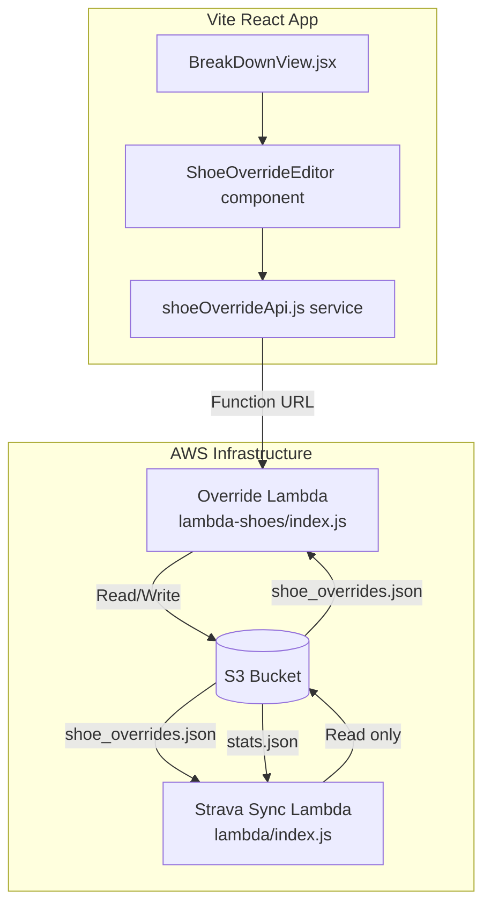

# Design Document: Workout Shoe Override

## Overview

This feature adds shoe attribution overrides for workout activities where multiple shoes are used in a single Strava recording. It spans three layers:

1. **Frontend (React)** — A shoe override editor component on the Breakdown page that detects workout activities, shows a two-segment shoe editor, validates inputs, and communicates with the Override Lambda via its function URL.
2. **Override Lambda** (`lambda-shoes/index.js`) — Already deployed, handles CRUD operations on `shoe_overrides.json` in S3. No changes needed to Lambda code itself.
3. **Strava Sync Lambda** (`lambda/index.js`) — Needs modification to load `shoe_overrides.json` and apply overrides when building shoe statistics in `buildStatsFromIndexItems`.

### Key Design Decisions

- **Two fixed segments** in the editor (not dynamic N segments) to keep the UI simple for the primary use case: warm-up shoe + workout shoe.
- **Lambda Function URL** used directly from the frontend (no API Gateway) — the Override Lambda already has CORS headers configured.
- **shoe_overrides.json** is a single flat JSON file keyed by activity ID string — simple, no database needed given the expected low volume of overrides.
- **Stats calculation modification** happens in the existing `buildStatsFromIndexItems` function by pre-processing the index items before the stats loop.

## Architecture



### Data Flow

1. User selects an activity on the Breakdown page
2. `BreakDownView` checks if activity name contains "WO", "Workout", or "Session"
3. If workout detected, renders `ShoeOverrideEditor` which calls the Override Lambda to load any existing override
4. User edits segments, frontend validates, then saves via Override Lambda
5. On next Strava sync, the Sync Lambda loads `shoe_overrides.json` and applies overrides to shoe statistics

## Components and Interfaces

### 1. `ShoeOverrideEditor` (React Component)

**Location:** `src/components/breakdown/ShoeOverrideEditor.jsx`

**Props:**
```typescript
interface ShoeOverrideEditorProps {
  activityId: string;
  activityName: string;
  totalDistanceM: number;
  stravaShoe: { name: string; gearId: string | null } | null;
}
```

**Responsibilities:**
- Load existing override from Lambda on mount
- Display two segment inputs (shoe name, gear_id, distance in km)
- Compute defaults from Strava shoe data when no override exists
- Validate inputs before save
- Handle save, delete, and error states
- Show success/error feedback

### 2. `shoeOverrideApi.js` (API Service Module)

**Location:** `src/lib/shoeOverrideApi.js`

**Exports:**
```javascript
// Configuration
const SHOE_OVERRIDE_LAMBDA_URL = import.meta.env.VITE_SHOE_OVERRIDE_URL || '';

// Load override for an activity
export async function loadOverride(activityId: string): Promise<{ override: OverrideEntry | null }>

// Save/update an override
export async function saveOverride(data: SavePayload): Promise<{ success: boolean; override: OverrideEntry }>

// Delete an override
export async function deleteOverride(activityId: string): Promise<{ success: boolean }>
```

### 3. `isWorkoutActivity` (Utility Function)

**Location:** `src/lib/shoeOverrideApi.js` (exported)

```javascript
export function isWorkoutActivity(activityName: string): boolean
```

Returns `true` if the activity name contains "WO", "Workout", or "Session" (case-sensitive).

### 4. `validateOverride` (Validation Function)

**Location:** `src/lib/shoeOverrideApi.js` (exported)

```javascript
export function validateOverride(segments, totalDistanceM): { valid: boolean; errors: string[] }
```

Validates:
- All segment shoe names are non-empty
- All segment distances are positive numbers not exceeding total
- Sum of segment distances equals total within 100m tolerance

### 5. Strava Sync Lambda Modification

**Location:** `lambda/index.js` — modify `buildStatsFromIndexItems`

**New behaviour:** Before the stats loop, load `shoe_overrides.json` from S3. For each index item, check if an override exists. If yes, replace the single shoe attribution with multiple segment attributions.

## Data Models

### Override Entry (stored in `shoe_overrides.json`)

```json
{
  "12345678": {
    "activity_id": "12345678",
    "total_distance_m": 12500,
    "segments": [
      { "shoe_name": "Saucony Tempus 2", "gear_id": "g28984775", "distance_m": 4000 },
      { "shoe_name": "ASICS Magic Speed", "gear_id": "g31234567", "distance_m": 8500 }
    ],
    "created_at": "2026-06-15T10:30:00.000Z",
    "updated_at": "2026-06-15T10:30:00.000Z"
  }
}
```

### Save Request Payload (Frontend → Lambda)

```json
{
  "action": "save",
  "activity_id": "12345678",
  "total_distance_m": 12500,
  "segments": [
    { "shoe_name": "Saucony Tempus 2", "gear_id": "g28984775", "distance_m": 4000 },
    { "shoe_name": "ASICS Magic Speed", "gear_id": "g31234567", "distance_m": 8500 }
  ]
}
```

### Load Response (Lambda → Frontend)

```json
{
  "activity_id": "12345678",
  "override": { ... } | null
}
```

### Stats Output Structure (unchanged)

The `byShoe` section in `stats.json` remains the same shape:
```json
{
  "byShoe": {
    "Saucony Tempus 2": { "distance_m": 846863, "count": 81, "moving_time_s": 245370, "last_date": "..." }
  }
}
```

The difference is that overridden activities contribute their segment distances to individual shoes rather than the full distance to a single shoe.

## Correctness Properties

*A property is a characteristic or behavior that should hold true across all valid executions of a system — essentially, a formal statement about what the system should do. Properties serve as the bridge between human-readable specifications and machine-verifiable correctness guarantees.*

### Property 1: Workout activity name detection

*For any* activity name string, `isWorkoutActivity` SHALL return `true` if and only if the string contains the substring "WO", "Workout", or "Session" (case-sensitive match).

**Validates: Requirements 1.1**

### Property 2: Default segment computation

*For any* activity with a total distance and an optional Strava-assigned shoe, when no override exists, the default segments SHALL be: segment 1 with the Strava shoe name (or empty if none), the Strava gear_id (or null), and the full activity distance; segment 2 with empty shoe name, null gear_id, and zero distance.

**Validates: Requirements 1.4, 1.5**

### Property 3: Distance sum validation

*For any* pair of segment distances and a total activity distance, the validation function SHALL accept the segments if and only if the absolute difference between the sum of segment distances and the total distance is less than or equal to 100 metres.

**Validates: Requirements 2.1, 2.2**

### Property 4: Segment field validation

*For any* segment, the validation function SHALL reject the segment if its shoe_name is empty, or its distance_m is not a positive number, or its distance_m exceeds the total activity distance.

**Validates: Requirements 2.3, 2.4**

### Property 5: Override data model integrity

*For any* valid save operation, the resulting override entry SHALL have: an activity_id string matching its object key, a total_distance_m greater than zero, a segments array of 2–10 entries each with non-empty shoe_name (≤100 chars), gear_id (string or null), and positive distance_m, plus ISO 8601 created_at and updated_at timestamps.

**Validates: Requirements 3.2, 3.3, 3.4, 3.5**

### Property 6: Save preserves created_at on update

*For any* existing override entry with a created_at timestamp, when the entry is updated via save, the resulting entry SHALL retain the original created_at value and SHALL have an updated_at value equal to or later than the original updated_at.

**Validates: Requirements 4.2**

### Property 7: Stats attribution with overrides

*For any* collection of activities and a set of shoe overrides:
- Activities with a matching override SHALL have each segment's distance_m attributed to the segment's shoe_name, and each unique shoe in the segments SHALL receive a run count increment of 1.
- Activities without a matching override SHALL have their full distance attributed to the Strava-assigned shoe with a run count increment of 1.
- The total distance across all shoe attributions SHALL equal the sum of all activity distances.

**Validates: Requirements 7.4, 7.5, 7.6, 7.7**

## Error Handling

| Scenario | Handling |
|----------|----------|
| Override Lambda unreachable (network error) | Frontend shows warning, falls back to Strava defaults in editor |
| shoe_overrides.json doesn't exist in S3 | Lambda returns empty/null; Sync Lambda uses empty overrides |
| shoe_overrides.json is malformed/unparseable | Lambda returns 500; Frontend shows error, uses Strava defaults |
| Save fails (S3 write error) | Lambda returns error; Frontend shows "Save failed" message, retains form values |
| Delete of non-existent override | Lambda returns 404; Frontend shows "not found" error |
| Activity has no distance data | Editor not shown (no distance to split) |
| Lambda function URL not configured | API calls fail immediately; Frontend shows configuration error |

## Testing Strategy

### Unit Tests (Example-Based)

- `ShoeOverrideEditor` renders with correct default values
- Editor shows delete button only when override exists
- Delete confirmation prompt appears before API call
- Error messages display for each validation failure type
- Success confirmation displays after save
- Loading state shows while fetching override

### Property-Based Tests

**Library:** [fast-check](https://github.com/dubzzz/fast-check) (JavaScript PBT library, already compatible with Vite/Node)

**Configuration:** Minimum 100 iterations per property test.

Each property test references its design document property:

- **Feature: workout-shoe-override, Property 1: Workout activity name detection** — Generate random strings, verify `isWorkoutActivity` correctly identifies names containing "WO"/"Workout"/"Session"
- **Feature: workout-shoe-override, Property 3: Distance sum validation** — Generate random distance pairs and totals, verify tolerance logic
- **Feature: workout-shoe-override, Property 4: Segment field validation** — Generate random segment data with edge cases, verify rejection of invalid fields
- **Feature: workout-shoe-override, Property 5: Override data model integrity** — Generate random valid inputs, save through the handler, verify output schema
- **Feature: workout-shoe-override, Property 6: Save preserves created_at** — Generate random existing overrides, save updates, verify timestamp preservation
- **Feature: workout-shoe-override, Property 7: Stats attribution with overrides** — Generate random activity sets and overrides, verify distance/count attribution and total distance conservation

### Integration Tests

- Override Lambda with mocked S3: save, load, delete operations
- Strava Sync Lambda stats calculation with override data
- Frontend API service calls with mocked fetch

### Manual Testing

- End-to-end flow: select workout activity → edit shoes → save → trigger sync → verify stats.json
